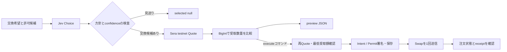

# Jev × Sera Protocol: TypeScript sample

自然言語の交換希望をJevで4つの方針に分類し、Seraの**Sepoliaテストネット**でJPYC → USDC / USDTを見積もるCLIです。
Jevは方針の分類を担当し、金額の計算と候補の比較はTypeScriptで行います。



## セットアップ

Node.js 22以上を使います。検証環境はNode.js 24.20.0です。

```bash
npm ci
cp .env.example .env
npm run check
npm test
```

見積もりには、`.env`の2項目を設定します。

| 環境変数 | 設定内容 |
|---|---|
| `TYPESAFE_API_KEY` | [TypeSafe dashboard](https://docs.typesafe.ai/introduction/quickstart)で取得したキー |
| `WALLET_ADDRESS` | 自分のSepoliaウォレットの公開アドレス |

`.env`はGitの対象外です。SeraのQuote APIは認証を要求しません。
previewは秘密鍵を読まず、署名やSwap送信を行いません。JevへのリクエストはAPI利用料が発生する場合があります。

## フォーマットとLint

[Biome](https://biomejs.dev/guides/getting-started/) 2.5.15を開発依存に固定しています。
`biome.json`でスペース2文字・1行100文字と推奨Lintルールを設定し、importも整理します。
`.gitignore`を尊重し、秘密情報の保存先`runs/`と生成されるlockfileは検査対象から除いています。

```bash
npm run format        # コードの整形
npm run format:check  # 整形状態の確認（書き換えなし）
npm run lint          # Lintのみ。警告も失敗として扱う
npm run biome:check   # 整形・Lint・importの検査
npm run biome:fix     # 整形と安全な自動修正
npm run verify        # Biome → TypeScript型チェック → オフラインテスト
```

## 見積もりと選択

```bash
npm run preview -- --amount 10000 --allow USDC,USDT \
  --request "Choose the destination with the greatest received amount."

npm run preview -- --amount 10000 --allow USDC,USDT \
  --request "Please exchange JPYC to USDC."
```

`--amount`はJPYCの表示単位です。指数表記、カンマ、decimalsを超える小数は受け付けません。
`--allow`は必須で、`USDC`、`USDT`、`USDC,USDT`を指定できます。
日本語の依頼文も入力できますが、今回、実モデルによる日本語・英語の分類精度は評価していません。

| JevのChoice | コードの動作 |
|---|---|
| `best_quote` | 全許可候補のガス控除後の受取数量を比較。1候補でも失敗したら見送り |
| `prefer_usdc` | USDCを選ぶ。許可外や見積もり失敗なら見送り |
| `prefer_usdt` | USDTを選ぶ。許可外や見積もり失敗なら見送り |
| `wait` | 見送り。Seraを呼び出さない |

confidenceが0.8未満でも見送ります。この閾値はサンプルの設定値で、約定成功率を示すものではありません。
同じ数量ならUSDCを優先します。指定先を他のトークンへ自動変更する処理はありません。

stdoutへJSONを1件出力します。`decision`に方針・confidence・確率・model・usage、
`candidates`に受取額・期限、`selected`に選択結果、`timings`に処理時間を記録します。
見送りは`selected: null`と`reason`、処理エラーはstderrの短いエラーコードで示します。
見送りの終了コードは0、処理エラーは1です。

## SepoliaでSwapを実行する場合

実行は別の`execute`コマンドです。入力JPYCがEIP-2612 Permitに対応し、
見積もりが全額ウォレット入金の経路を返した場合に限定しています。
approve、Vaultのequity、ループ売買には対応していません。

追加で`.env`を設定し、そのウォレットにテストJPYCを用意します。

| 環境変数 | 設定内容 |
|---|---|
| `TESTNET_PRIVATE_KEY` | `WALLET_ADDRESS`と一致するSepolia用秘密鍵 |
| `SEPOLIA_RPC_URL` | chainIdが11155111のRPC URL |
| `SERA_API_KEY` / `SERA_API_SECRET` | 同じownerのテストネットAPIキー。注文状態の照会に使用 |

### Sera APIキーの発行

`.env`の`WALLET_ADDRESS`と`TESTNET_PRIVATE_KEY`を設定した後、以下を実行します。
`SERA_API_KEY` / `SERA_API_SECRET`は空欄のままで構いません。

```bash
npm run sera:key:create
```

Seraテストネットの設定とサーバー時刻を取得し、`ManageApiKey(owner, action=create, timestamp)`を
ローカルでEIP-712署名して`POST /api-keys`へ送ります。
RPC URL、Sepolia ETH、テストJPYC、TypeSafeのキーは発行に必要ありません。
これはAPIの読み取り用キーの発行で、チェーン上のトランザクションやSwapは送信しません。
[公式Authentication](https://docs.testnet.sera.cx/api-reference/authentication/)

取得した2つの値は`.env`へ保存し、画面には表示しません。
`.env`は権限0600で更新し、他の設定は保ちます。既存のSeraキーが入っていたら上書きせず終了します。
シークレットは発行時に一度だけ返るため、`runs/private/sera-api-key-<ランダムID>.json`にも
権限0600で控えを保存します。署名用の秘密鍵は、この控えには含めません。

成功時は`status: saved`と保存先を表示します。
`.env`を更新できなかった場合は`status: saved_to_backup`と`backup_file`を表示するので、
その非公開ファイルから値を`.env`へ移してください。保存ファイルや内容をコミット・共有しないでください。
発行POSTの自動再試行は行いません。応答が失われた場合、キーが発行済みかもしれないため、
公式の一覧・失効手順で状態を確認してから再発行を判断してください。

このサンプルはfaucet操作を行いません。

```bash
# 受取額が60 USDC / USDT以上であることを要求する例
npm run execute -- --amount 10000 --allow USDC,USDT --min-output 60 \
  --request "Choose the destination with the greatest received amount."

# 受付後のtrade_idが判明している場合の再照会。Swapは送らない
npm run status -- --trade-id YOUR_TRADE_ID
```

実行時はRPCのチェーン、ウォレット、JPYCのdecimalsと残高を確認します。
署名前に見積もりを取り直します。比較方針では全許可候補を取り直し、指定先の方針ではその候補だけを取り直します。
最低受取額を下回る場合や期限切れの場合は送信しません。

完全な署名済みbodyは送信前に`runs/private/<quote-id>.json`へ保存します。
ファイルは権限0600、ディレクトリはGitの対象外です。署名を含むため公開しないでください。
同じ作業フォルダ・同じownerの同時実行はロックファイルで止めます。

`POST /swap`は1回だけ送ります。通信失敗や不明な応答では`unknown`とし、再送・再Quoteを自動実行しません。
`success: true`や`pending`は決済完了として扱いません。
注文APIで全fillの決済完了を確認し、最新のsettlement transactionのreceiptが成功した場合に`settled`を出します。
照会は約120秒で打ち切り、未確定・失敗の終了コードは1です。HTTP/RPCの待ち時間により多少超過する場合があります。
全fillの個別receiptの照合は行っていません。

`unknown`ではロックを残します。trade_idがあれば`status`で再照会し、終端状態を確認すると対応するロックを解除します。
trade_idが不明、または保存に失敗した場合は、署名body・受付記録・ownerの注文一覧を確認してから再実行を判断してください。
ロックの場所は`runs/private/<ownerの小文字アドレス>.lock`です。削除だけで結果不明を解決したことにはなりません。

## ファイルと検証

| ファイル | 内容 |
|---|---|
| `src/jev.ts` | SDK、4候補のChoice、返答の実行時検査 |
| `src/sera.ts` | テストネットREST、registry、金額変換、Quote検査 |
| `src/index.ts` | CLI、方針の制約、整数比較、preview |
| `src/execute.ts` | EIP-712署名、保存、1回送信、決済照会 |
| `src/create-sera-api-key.ts` | APIキー発行と非公開保存 |
| `test/sample.test.ts` | モックHTTPと公開テスト鍵を使うオフライン検証 |

通常の`npm test`は外部API、課金、実送信を使いません。
金額の桁差、許可候補、期限、JSON境界、署名の復元、保存失敗、送信結果不明、pendingとsettledの違いを検証します。
依存はSDK 0.6.0・ethers 6.17.0を含め、`package-lock.json`に固定しています。

2026-10-04に公開テストネットAPIのconfig・registry・server timeと、未署名の2候補Quoteを照会しました。
Jevの実推論、APIキーのライブ発行・注文照会、署名付きSwapのライブ実行は未検証です。

## 設計上の前提と公式資料

API baseは`https://api.testnet.sera.cx/api/v1`、チェーンはSepoliaに固定しています。
トークンのアドレスとdecimalsは起動時に取得します。調査時のテストJPYCは6桁でした。
`receive_less`の`minOutputAmount`はガス控除後なので、さらにガスを引きません。
USDCとUSDTを同じUSD単位の**数量**として比較しており、市場価値の同一性は保証しません。
Batch Quoteは各候補を独立して計算するため、同時刻の価格スナップショットではありません。

- [Jev JavaScript SDK](https://docs.typesafe.ai/sdk/javascript) / [SDK v0.6.0](https://github.com/typesafe-ai/typesafe-sdk-js/tree/v0.6.0)
- [Sera System endpoints](https://docs.testnet.sera.cx/api-reference/endpoints/system/)
- [Sera Swap endpoints](https://docs.testnet.sera.cx/api-reference/endpoints/swaps/)
- [Sera Order endpoints](https://docs.testnet.sera.cx/api-reference/endpoints/orders/)

テストネット資料とdev資料には、Permit・nonce・再送仕様の差があります。
この実装はテストネット資料にあるJPYCのPermit経路だけを扱い、Swapの冪等再送を仮定していません。
